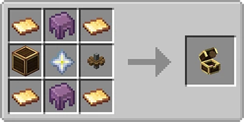
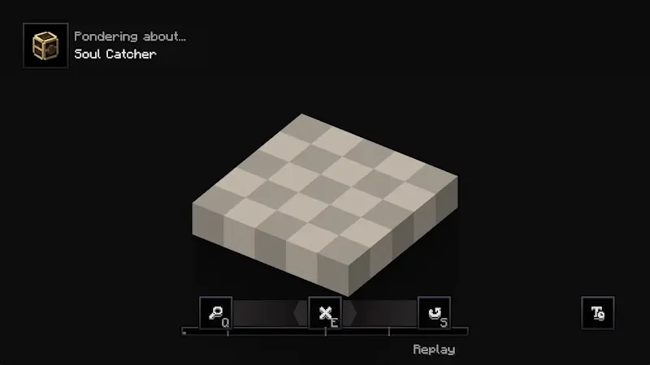
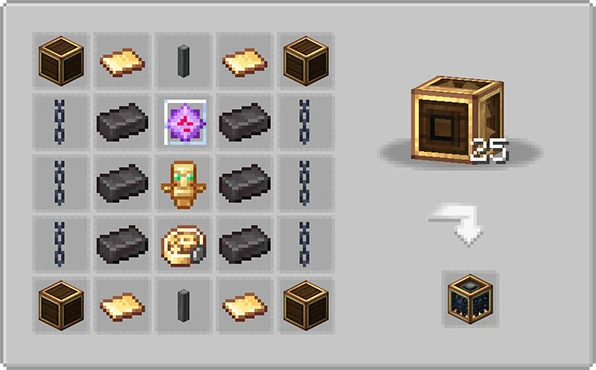
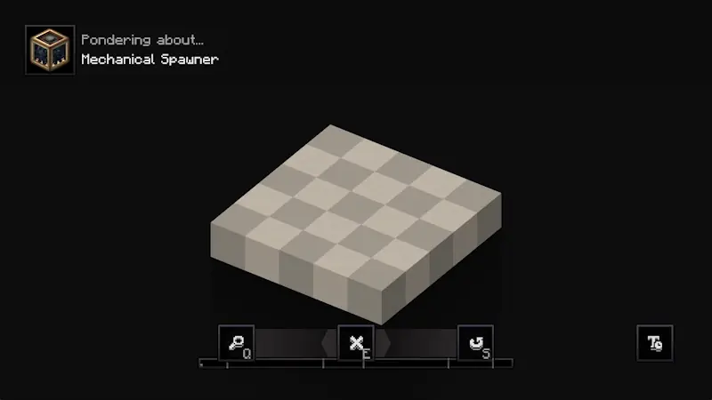

<p align="center">
  
  <br><br>
  
  <br><br>
  <a href="https://www.curseforge.com/minecraft/mc-mods/create-mob-spawners"></a>
  &nbsp
  <a href="https://modrinth.com/mod/create-mob-spawners"></a>
</p>

# ⚙️ Create: Mob Spawners
An addon for the [Create](https://github.com/Creators-of-Create/Create) mod for Minecraft. It adds a tool that can catch mobs which can then be placed into a spawner. It aims to be "immersive" by making use of the base game magic components.

## 🆕 What does it add?
### Soul Catcher


The Soul Catcher is a new item that can capture a mob's soul.
For this to work, the mob needs to have an active weakness effect which could be applied using a throwable potion of weakness.
Mobs that should not be capturable can be adjusted in the config. Bosses are not capturable by design.

The time it takes to catch a mob depends on its hitbox volume, so something small like a chicken will be caught pretty quickly while something big like a ghast can take some time.

While a mob is being captured, its AI will be disabled, so it will not be able to move or attack.

It can be crafted using this recipe:



This is how it looks ingame:


Ponder scene:



### Mechanical Spawner


The Mechanical Spawner is a new kinetic block that can spawn mobs according to the Soul Catcher placed inside.
For this to work, it needs rotational force and a supply of liquid. Refer to recipes in JEI for more information about this.

The spawner will repeatedly spawn the contained mob type in the same range a vanilla spawner would. When 6 or more mobs of this type are already inside of this range, the spawner will stall.

It needs a minimum rotation speed of 128 RPM and its stress impact depends on the contained mob types max health, so something like an enderman will require a lot more SU than a chicken.

The Mechanical Spawner can be crafted in a 5x5 Mechanical Crafter grid using this recipe:



This is how it looks ingame:


Ponder scene:



The exact stress impact is calculated using this graph (the cap at 80 SU / RPM is configurable):


Some examples:

| Mob      | SU @ 128 RPM | SU @ 256 RPM |
|----------|--------------|--------------|
| Chicken  | 1,024        | 2,048        |
| Ghast    | 1,769        | 3,538        |
| Zombie   | 2,560        | 5,120        |
| Enderman | 5,120        | 10,240       |
| Ravager  | 10,240       | 20,480       |

Note that the Ravagers stress impact is capped in this example, as the default configuration will cap everything at 80 SU / RPM.

## 🤝 Integrations / Compatibilities

### JEI

Displays:
- Fluid and required amount
- Spawning duration at minimum and maximum RPM
- Additional spawn attempts
  - 1 spawned entity is guaranteed, additional attempts rely on RNG to find a fitting spot for the mob, so a spawner without any obstruction in its range will work most efficiently


### Jade

Displays:
- Contained mob type
- Contained fluid
- Progression status
- Reason for stalling (if applicable)


### Recipes

Required liquids and their effects are defined in standard minecraft recipes. They can easily be modified using something like *KubeJS*.

This is the recipe for spawning with standard Potion of Regeneration liquid:

```json
{
  "type": "create_mob_spawners:spawning",
  "input": {
    "amount": 200,
    "fluid": "create:potion",
    "nbt": {
      "Potion": "minecraft:regeneration",
      "Bottle": "REGULAR"
    }
  },
  "spawn_ticks_at_max_speed": 100,
  "additional_spawn_attempts": 0
}
```

- `input.nbt.Bottle` refers to the potion bottle type and can be either `REGULAR`, `SPLASH` or `LINGERING`
- everything else should be self-explanatory